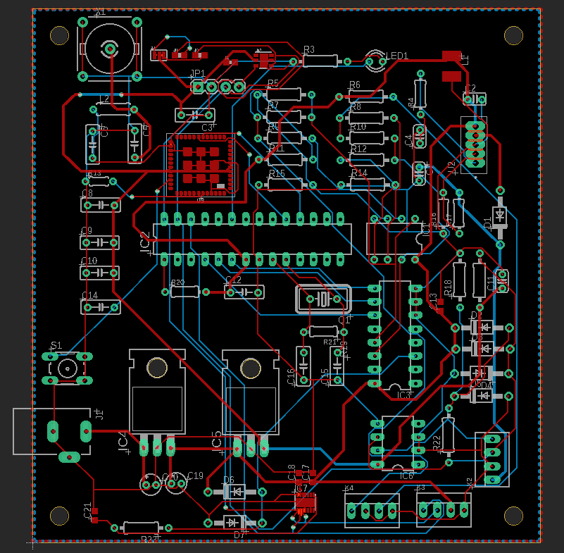

# Iot
Repositorio códigos curso Análisis y Diseño de Sistemas basados en Internet de las Cosas (IoT).

## Integrantes 
Ricardo Garcia, FCFM.  
Benjamín Irarrazabal, FCFM.  
Joaquín Zepeda, FCFM.  

# Diseño PCB

Se diseño la siguiente placa PCB para un sistema de regadio automático. 

